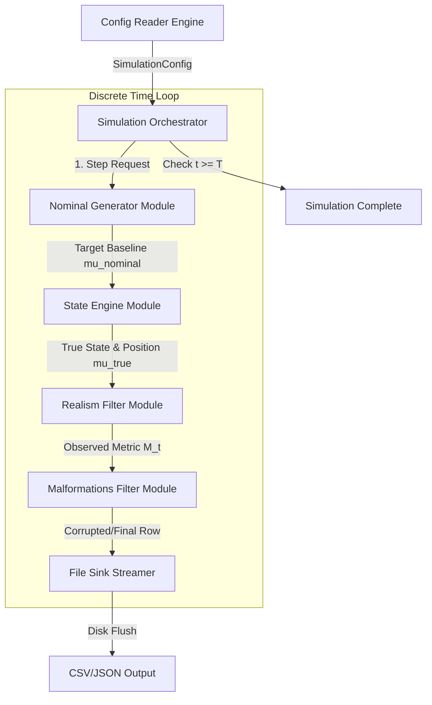

# Operational Data Generator

> A config-driven, discrete-time simulator for generating realistic synthetic time-series data — for testing data analytics pipelines, data science models, and operations research problems without needing real production data.

## Motivation

Testing a downstream system — a dashboard, an ML model, an OR pipeline — usually means either waiting for real operational data or hand-rolling small, static mock datasets. Neither scales well, and hand-rolled mocks rarely capture the messiness of real data: draft, noise, backlog effects and outright malformed records.

This project solves that by treating data generation as a simulation problem rather than a sampling problme. Instead of drawing i.i.d. rows from a distribution, it runs entities forward through a discrete-time tick loop ($t\to t + dt$), letting operational character — recimes, state transitions, contention, corruption — emerge over the run the way it would in a real system. The result is data that can be dropped straight into a dashboard, model or OR paper for sandbox testing before anything touches production.

## How It Works

The core is a deterministic, discrete-time event simulation driven by a central Simulation Orchestrator, evaluated steb-by-step wtih an O(1) memory footprint rather than generated as a full batch in memory.



Each tick, entity's state moves through four stages:

**1. Nominal Generator** — computes the deterministic, ideal-world target baseline for the entity (max velocity, zero dwell time, zero contention, etc.)

**2. State Engine** — applies regime/state transitions (e.g. Markovian performance shifts) on top of the nominal baseline.

**3. Realism Filter** — layers in volatility, noise, and backlog effects to move from an idealized value to an observed one.

**4. Malformations Filter** — applies schema corruptions and data-quality issues that mirror real-world dirty data.

Configuration is entirely YAML-driven: a single `config.yaml` declares the metric space, entities, network topology, resource contention rules, workflow DAGs, and pipeline toggles for each of the four stages above. The config layer validates this in two phases — structural/type validation via Pydantic v2 schemas, then cross-field domain invariants (dimensional consistency, DAG acyclicity, bounds checking, path/security containment) — so bad configs fail fast, before any simulation step runs.

Full design detail lives in docs/hld.md (system-level design) and docs/lld.md (module-level contracts, invariants, and data structures.)

## Current Status

This is an active work in progress. Build status by module:

| **Module**              | **Is Built** | **Is Tested** | **Status Notes**                                                                                               |
|-------------------------|--------------|---------------|----------------------------------------------------------------------------------------------------------------|
| Config Reader           | True         | True          | Two-phase validation, AST formula whitelisting, immutability enforcement                                       |
| Simulation Orchestrator | Partial      | False         | Functional as the tick-loop driver, but only nominal generator plugged into functionality                      |
| Nominal Generator       | True         | True          | Initital test suite in place, need refactoring and securing of code and deeper testing before marking complete |
| State Engine            | False        | False         | Not yet implemented                                                                                            |
| Realism Filter          | False        | False         | Not yet implemented                                                                                            |
| Malformation Filter     | False        | False         | Not yet implemented                                                                                            |
| File Sink Streamer      | False        | False         | Not yet implemented                                                                                            |

In short: the config layer and data contract it enforces are solid, the nominal-generation pass is working and tested (albeit limited testing), and the orchestrator scaffolding is in place. The remaining pipeline stages have yet to be implemented.

## Installation

```bash
git clone https://github.com/JohnTippie/stochastic_data_generator
cd stochastic_data_generator
pip install -r requirements.txt
```

For development (includes test dependencies):
```bash
pip install -r requirements-dev.txt
```

## Usage

Run with the default config:
```bash
python main.py
```

`config.yaml` controls everything about a run — simulation window and resolution, which pipeline stages are active (`pipeline_toggles`), the metric space (including AST-defined derivative metrics), entities, network topology, resource pools, and workflwo DAGs. See docs/lld.md for the full schema and validation rules, or `config.yaml` itself for an annotated example.

## Testing

Config validation (`test/config./`) and nominal generation (`test/simulation/nominal_gen.py`) currently have test coverage; orchestrator-level tests are in process as that module's scope solidifies alongside the remaining pipeline stages.

## Roadmap

[] Implement State Engine (regime/state transition logic)

[] Implement Realism Filter (volatility, noise, backlog)

[] Implement Malformations Filter (schema, corruption, data-quiality defects)

[] Ochestrator test suite

[] File sink streaming (CSV, JSON output)
