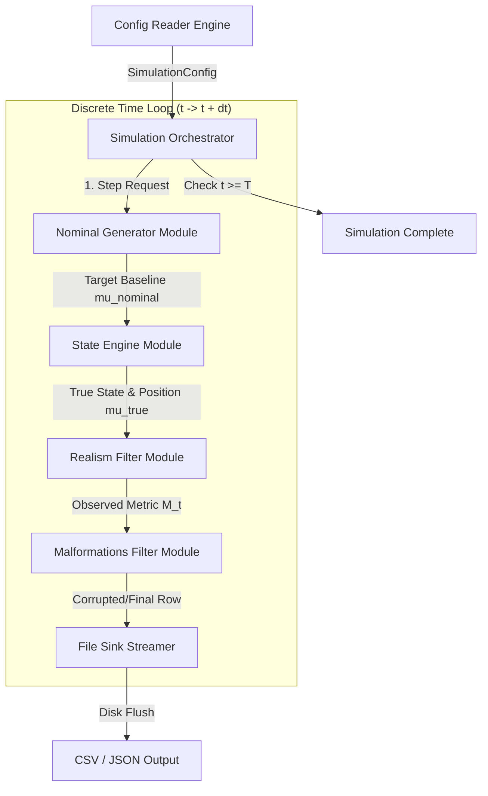
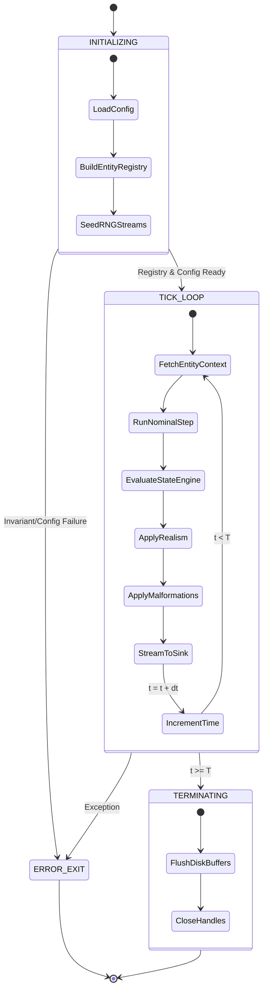
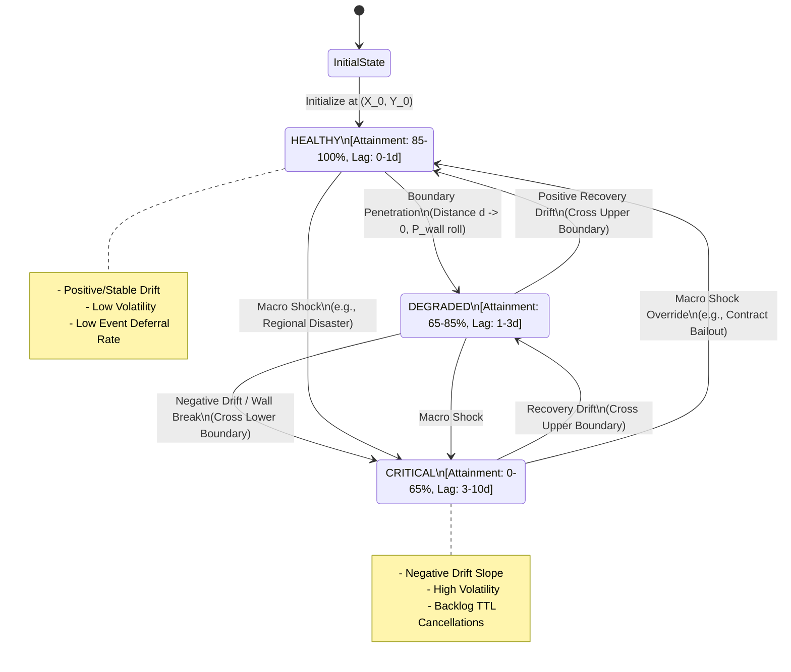

# Stochastic Data Generator: High Level Design Document

---

## 1.0 Context

### 1.1 Objective

This program is designed to create a singular interface for testing a variety of data analytics or data science style problems by generating fake data with random operational noise. The program also intends to approximate reality by allowing dynamic behavior regimes and state transitions (e.g., Markovian performance shifts) to be selected within the data generation, allowing the operational data to change character over time.

### 1.2 Background

The intent behind this program is to solve a known problem in the data design sector by allowing near operational data to be used instead of production data. Rather than individual mockups, this program will be able to output most kinds of data needed to plumb into a data analytics dashboard, a data science model, or even an operations research paper. Often times this form of mock up requires the user to manually create static data or small noisy data sets, using this tool the data will create itself independent of any real operation allowing complete sandbox testing and validation before a system is implemented into a production environment.

---

## 2.0 Design Overview

### 2.1 Overview

The intial program will be a configurable .yaml file which then can be executed upon by the program. The core program operates as a deterministic, discrete-time event simulation driven by a central Simulation Orchestrator. Instead of generating full datasets in memory across batch passes, the ssytem evaluates time step-by-step (t->t+dt) using an O(1) memory footprint tick loop



During this step the high level data responsibilies are as follows:

| **Module**              | **Execution Responsibility**                                                                                                                                        | **State Mutabilitiy**     |
|-------------------------|---------------------------------------------------------------------------------------------------------------------------------------------------------------------|---------------------------|
| Simulation Orchestrator | Maintains active simulation clock (t), entity state registry, and route/DAG progression. Toggles disabled modules based on configuration flags.                    | System State Authority    |
| Nominal Generator       | Calculates target uncorrupted metric baseline ($\mu_{t\text{,nominal}}$) and ideal kinematic progress for tick t. Has zero awareness of operational shocks or noise | Pure / Stateless Function |
| State Engine            | Applies regime drift, evaluates macro shocks ($\mu_{t\text{,true}}$), and resolves boundary walls to calculate true position and macro state ($S_t$).               | Pure State Transformer    |
| Realism Filter          | Injects volatility noise ($\mathcal{N}(0,\sigma^2)$) into $\mu_{t\text{,true}} to produce $M_{t\text{,observed}}$ and process backlog/deferral queues.              | Pure Transformer          |
| Malformations Filter    | Evaluates per-field corruption rules (null injection, formatting errors, out-of-bounds spikes) on $M_{t\text{,observed}}$.                                          | Pure Transformer          |
| File Sink Streamer      | Formats transformed row payload according to `sink.fields` and appends directly to active disk buffer.                                                              | Append-Only Stream        |



### 2.2 Functional Requirements

* Must accept a .yaml config path
* Must shift entity states across epoch boundaries using a configurable transition matrix
* Must output as a selectable style (CSV/JSON)

### 2.3 Capacity Estimates

TBD Post MVP

### 2.4 Interfaces

Currently the only accepted input stream for the program is a config.yaml file outlined below using sample selections:

```yaml
# ==============================================================================
# 1. META & SIMULATION CONTROL
# ==============================================================================
meta:
  scenario_name: "comprehensive_or_master_simulation"
  description: "Unified master blueprint covering spatial graphs, shared resources, task DAGs, state regimes, and real-world data corruption."
  seed: 42 # Master PRNG seed for deterministic execution

simulation:
  start_time: "2026-09-01T00:00:00Z" # ISO-8601 start timestamp
  duration: "30d"                     # Total run time [quantity][s|m|h|d|w]
  data_resolution: "1m"               # Frequency of emitted output rows
  epoch_interval: "1h"               # State engine & transition evaluation tick

# ==============================================================================
# 2. PIPELINE MODULE TOGGLES
# Master switches that enable or bypass specific generation passes/engines
# ==============================================================================
pipeline_toggles:
  use_state_engine: true
  use_network_topology: true    # Unlocks graph routing & dynamic adjacency
  use_resource_contention: true # Unlocks shared capacity locks (docks, cranes)
  use_workflow_dag: true        # Unlocks task precedence / job-shop scheduling
  use_realism_filter: true      # Applies volatility noise & backlog queues
  use_malformations_filter: true # Applies schema corruptions & syntax errors

# ==============================================================================
# 3. N-DIMENSIONAL METRIC SPACE DEFINITIONS
# Canonical metric space degrees of freedom (primitive values & AST derivations)
# ==============================================================================
metrics:
  - name: "transit_velocity_mph"
    is_derivative: false
    primitive_type: "float"

  - name: "fuel_level_pct"
    is_derivative: false
    primitive_type: "float"

  - name: "queue_dwell_time_min"
    is_derivative: false
    primitive_type: "float"

  - name: "equipment_wear_index"
    is_derivative: false
    primitive_type: "float"

  # Derivative metrics (parsed at runtime via AST expressions)
  - name: "fuel_burn_rate_per_mile"
    is_derivative: true
    primitive_type: "float"
    formula: "(100.0 - fuel_level_pct) / clamp(transit_velocity_mph, 1.0, 120.0)"

  - name: "operational_risk_score"
    is_derivative: true
    primitive_type: "float"
    formula: "(equipment_wear_index * 0.6) + (queue_dwell_time_min * 0.4)"

# ==============================================================================
# 4. OR EXTENSION MODULES
# ==============================================================================

# --- 4A. NETWORK TOPOLOGY ENGINE (Spatial Graphs & Zero Teleportation) ---
# Note either routes or adjacency_matrix must be filled depending on toggle
network_topology:
  routing_type: "stochastic_adjacency_walk" # Options: [stochastic_adjacency_walk, shortest_path_dijkstra]
  network_class: "linear" # Default: Linear [future implementation may expand to hub-and-spoke]
  nodes: ["DEPOT_NORTH", "HUB_CENTRAL", "TERMINAL_SOUTH"]
  use_defined_routes: true

  routes:
    "DEPOT_NORTH->HUB_CENTRAL":
      distance_miles: 120.0
      nominal_travel_time_min: 130
      max_throughput_capacity: 50 # Vehicles/hour
      max_route_speed: 65 # Maximum speed in miles per hour the route can operate
    "HUB_CENTRAL->TERMINAL_SOUTH":
      distance_miles: 85.0
      nominal_travel_time_min: 90
      max_throughput_capacity: 30
      max_route_speed: 65

  adjacency_matrix:
    DEPOT_NORTH:
      - destination: "HUB_CENTRAL"
        weight: 1.0
    HUB_CENTRAL:
      - destination: "TERMINAL_SOUTH"
        weight: 0.7
      - destination: "DEPOT_NORTH"
        weight: 0.3
    TERMINAL_SOUTH:
      - destination: "HUB_CENTRAL"
        weight: 1.0

# --- 4B. RESOURCE CONTENTION ENGINE (Shared Bottlenecks / Capacities) ---
resource_pools:
  - id: "CENTRAL_UNLOADING_DOCKS"
    total_capacity: 4 # Maximum simultaneous entities allowed access
    queue_policy: "FIFO" # Options: [FIFO, PRIORITY_QUEUE, LIFO]
    queue_contention_penalty_min: 15.0 # Added delay rate per queued epoch

  - id: "HEAVY_LIFT_CRANE"
    total_capacity: 1
    queue_policy: "PRIORITY_QUEUE"
    queue_contention_penalty_min: 45.0

# --- 4C. WORKFLOW DAG ENGINE (Task Precedence & PERT/CPM Scheduling) ---
workflow_dag:
  tasks:
    - task_id: "INBOUND_INSPECTION"
      nominal_duration_min: 20
      predecessors: []

    - task_id: "UNLOAD_CARGO"
      nominal_duration_min: 45
      predecessors: ["INBOUND_INSPECTION"]
      required_resource_pool: "CENTRAL_UNLOADING_DOCKS" # Ties into 4B

    - task_id: "HEAVY_STAGING"
      nominal_duration_min: 30
      predecessors: ["UNLOAD_CARGO"]
      required_resource_pool: "HEAVY_LIFT_CRANE"

# ==============================================================================
# 5. NOMINAL GENERATOR (Pragmatic Zero-Noise Baseline)
# ==============================================================================
nominal_generator:
  baseline_metrics:
    transit_velocity_mph: 62.0
    fuel_level_pct: 100.0
    queue_dwell_time_min: 0.0
    equipment_wear_index: 0.05

# ==============================================================================
# 6. STATE ENGINE (Behavioral Regimes, Drift Vectors & Shocks)
# ==============================================================================
state_engine:
  initial_state: "OPTIMAL_FLOW"

  states:
    OPTIMAL_FLOW:
      state_bounds:
        transit_velocity_mph: [50.0, 75.0]
        fuel_level_pct: [20.0, 100.0]
        queue_dwell_time_min: [0.0, 15.0]
        equipment_wear_index: [0.0, 0.3]
      drift_rates:
        equipment_wear_index: 0.001
        fuel_level_pct: -0.5
      volatilities:
        transit_velocity_mph: 2.0
        fuel_level_pct: 0.1
      boundary_stiffness: 0.85

    CONGESTED_BOTTLENECK:
      state_bounds:
        transit_velocity_mph: [0.0, 25.0]
        fuel_level_pct: [10.0, 100.0]
        queue_dwell_time_min: [15.0, 120.0]
        equipment_wear_index: [0.3, 0.7]
      drift_rates:
        queue_dwell_time_min: 2.5
        equipment_wear_index: 0.008
      volatilities:
        transit_velocity_mph: 4.0
        queue_dwell_time_min: 5.0
      boundary_stiffness: 0.40

    CRITICAL_BREAKDOWN:
      state_bounds:
        transit_velocity_mph: [0.0, 0.0]
        fuel_level_pct: [0.0, 100.0]
        queue_dwell_time_min: [120.0, 600.0]
        equipment_wear_index: [0.7, 1.0]
      drift_rates:
        queue_dwell_time_min: 10.0
      volatilities:
        queue_dwell_time_min: 15.0
      boundary_stiffness: 0.10

  transition_matrix:
    OPTIMAL_FLOW:
      OPTIMAL_FLOW: 0.90
      CONGESTED_BOTTLENECK: 0.10
    CONGESTED_BOTTLENECK:
      CONGESTED_BOTTLENECK: 0.80
      OPTIMAL_FLOW: 0.15
      CRITICAL_BREAKDOWN: 0.05
    CRITICAL_BREAKDOWN:
      CRITICAL_BREAKDOWN: 0.85
      OPTIMAL_FLOW: 0.15 # Maintenance event / reset

  macro_shocks:
    - name: "major_highway_accident_closure"
      probability_per_epoch: 0.005
      target_state: "CONGESTED_BOTTLENECK"
      instant_metric_overrides:
        transit_velocity_mph: 0.0
        queue_dwell_time_min: 90.0

    - name: "catastrophic_engine_failure"
      probability_per_epoch: 0.001
      target_state: "CRITICAL_BREAKDOWN"
      instant_metric_overrides:
        transit_velocity_mph: 0.0
        equipment_wear_index: 0.95

# ==============================================================================
# 7. REALISM FILTER (Backlog Queues, Volatility & Global Safeguards)
# ==============================================================================
realism_filter:
  # One-way coupled backlog/deferral policy
  deferral_policy:
    enabled: true
    driver_metric: "queue_dwell_time_min"
    max_drift_ttl_epochs: 5 # Cancel task if deferred > 5 epochs
    base_probabilities:
      fulfillment: 0.80
      deferral: 0.15
      cancellation: 0.05
    aging_rules:
      cancel_escalation_per_epoch: 0.10

  # Physical hard clamping rails across all calculations
  global_limits:
    transit_velocity_mph: [0.0, 120.0]
    fuel_level_pct: [0.0, 100.0]
    queue_dwell_time_min: [0.0, 1440.0]
    equipment_wear_index: [0.0, 1.0]

# ==============================================================================
# 8. MALFORMATIONS FILTER (Data Corruption Stress-Testing)
# ==============================================================================
malformations_filter:
  enabled: true
  corruption_rules:
    - type: "null_injection"
      probability: 0.002
      target_fields: ["transit_velocity_mph", "fuel_level_pct"]

    - type: "out_of_range_spike"
      probability: 0.001
      target_fields: ["queue_dwell_time_min"]
      spike_value: -999.0 # Telemetry sensor disconnect flag

    - type: "string_formatting_error"
      probability: 0.002
      target_fields: ["telemetry_status_code"]
      corrupted_value: "ERR_GPS_SAT_LOST_TIMEOUT"

# ==============================================================================
# 9. ENTITIES (Target System Assets)
# ==============================================================================
entities:
  - id: "TRUCK_ASSET_101"
    entity_type: "heavy_freight_hauler"
    initial_location: "DEPOT_NORTH"
    initial_state: "OPTIMAL_FLOW"
    initial_metrics:
      transit_velocity_mph: 65.0
      fuel_level_pct: 100.0
      queue_dwell_time_min: 0.0
      equipment_wear_index: 0.05

  - id: "TRUCK_ASSET_102"
    entity_type: "heavy_freight_hauler"
    initial_location: "HUB_CENTRAL"
    initial_state: "OPTIMAL_FLOW"
    initial_metrics:
      transit_velocity_mph: 58.0
      fuel_level_pct: 85.0
      queue_dwell_time_min: 5.0
      equipment_wear_index: 0.12

# ==============================================================================
# 10. FILE SINK & OUTPUT MAPPING
# ==============================================================================
sink:
  format: "csv"
  output_path: "./output/master_or_simulation_output.csv"

  metadata_toggles:
    include_state: true          # Emits active state label (e.g., OPTIMAL_FLOW)
    include_malformed_flag: true # Emits true/false if row was corrupted
    include_true_baseline: false # Emits true mu_t coordinate vector

  fields:
    - name: "timestamp"
      source: "system.timestamp"
    - name: "vehicle_id"
      source: "entity.id"
    - name: "operational_regime"
      source: "system.state_label"
    - name: "current_node"
      source: "system.current_location"
    - name: "speed_mph"
      source: "metrics.transit_velocity_mph"
    - name: "fuel_pct"
      source: "metrics.fuel_level_pct"
    - name: "dwell_min"
      source: "metrics.queue_dwell_time_min"
    - name: "burn_rate"
      source: "derivative_metrics.fuel_burn_rate_per_mile"
    - name: "risk_score"
      source: "derivative_metrics.operational_risk_score"
    - name: "backlog_depth"
      source: "system.backlog_depth"
    - name: "is_corrupted"
      source: "system.is_malformed"
```

The file sink produces dynamic schemas based on the `output.fields` array defined in the configuration. Users map standard engine attibutes (timestamps, entity IDs, metric values) to arbitrary column headers. Optional boolean flags under metadata_toggles allow users to selectively append system state labels, noise flags, or true baselines for validation and debugging.

### 2.5 Data Model

Terminology will be domain-agnostic in nature with the following being the dictionary used:

* **Entity:** The target object (e.g., Partner, Sensor, Customer)

* **State:** Active operational regime (e.g., Target, Degraded, Critical)

* **Metric:** Numeric value emitted per step (e.g., Attainment Percent, Temperature)

* **Epoch:** Time interval between state transition checks

* **True Metric Position ($\mu_t$):** The deterministic baseline coordinate of the entity. State transitions and 2D bounding box checks run exclusively on $\mu_t$.

* **Observed Metric ($M_t$):** The final emitted value equal to $\mu_t +$ Volatility Noise ($\mathcal{N}(0,\sigma^{2})$).

* **Global Bounds:** Absolute physical boundaries that clamp values to prevent Out-Of-Bounds (OOB) compounding. This can change per entity.

* **epoch_interval:** How often the state engine re-evaluates state transitions, macro-shocks and updates $\mu_t$.

* **data_resolution:** How often output rows are emitted.

---

## 3.0 Detailed Design

### 3.1 Details

* **Configuration Ingestion & Validation Engine:** 

  * **4-Tier Schema Hierarchy (`schemas.py`):** Utilizes Pydantic v2 with strict immutability (`frozen=True`) and custom `FrozenDict` (`MappingProxyType`) attributes. Composes configs across four strict layers: (1) Base/Custom Types, (2) Leaf Config Models, (3) Section Container Modules, (4) Root `SimulationConfig`.

  * **Phase 1 - Structural Validation (`schemas.py`):** Ingests raw YAML via `yaml.safe_load()`. Enforces strict type casting, missing keys, field bounds, and forbidden extra fields (`extra='forbid'`).

  * **Phase 2 - Domain Invariant Engine (`invariants.py`):** Validates relational and cross-field domain logic post-parsing:

    * *Time Granularity Hierarchy:* $\text{Asserts resolution} \leq \text{epoch_interval} \leq \text{duration}$.

    * *Dimensional Alignment:* Asserts all state metrics, drift vectors, volatilities, baseline metrics, initial entity metrics, and deferral drivers strictly match the canonical degrees of freedom declared in `metrics`.

    * *Spatial & Graph Integrity:* Asserts DAG acyclicity (via DFS) in `workflow_dag` and verifies all node pairs in `network_topology` map to declared nodes.

    * *State Engine Relational Checks:* Verifies state transitions map to declared state keys and ensures `macro_shocks` overrides do not violate state bounds or global limits.
  
  * **AST Formula Engine (`formulas.py`):** Validates derivative metric formulas via Python `ast.parse()`. Enforces node whitelisting, function whitelisting(`abs`, `min`, `max`, `clamp`, `sqrt`, `log`, `exp`, `pow`), and DFS cycle detection across derivative dependencies.

  * **Security & I/O Safeguards (`io.py` & `reader.py`):** 

    * *File Size Limit (CWE-776):* Caps raw config file size at 10MB to prevent YAML anchor expansion DoS attacks.

    * *Path Traversal Sandboxing (CWE-22):* Resolves output target paths via `Path.resolve()` to follow symlinks and collapse `..` traversals. Enforces directory containment within the workspace or temp directory, explicitly blocking system paths (`/etc`, `/usr`, `C:\Windows`).

* **State Engine:** - The purpose of this module is to evaluate the state and state transitions of each entity over a given epoch. This module allows probablistic changes and is not a fixed event generator. This is a toggleable module.

  * Macro-Shock Order of Operations: Rule here is that macro-shocks suppress and override normal drift for the selected epoch. Logic flow on this is that if a shock triggers, $S_t$ and $\mu_t$ are both set via the shock, local drift and boundary checks will be skipped for the epoch. Otherwise if the shock does not trigger, standard drift and boundary rules apply.

  * Exponential Decay Boundary Resolution: When true position $\mu_t$ moves toward a state boundary wall, the probability of "breaking through" the wall into an adjacent state box is governed by a Exponential Decay Barrier Function:
    $P(\text{Wall Break})=(1.0-\kappa)\cdot e^{-\lambda\cdot d}$

    $\kappa$: This is the boundary stiffness whcih directly controls the probability at the exact wall

    d: is defined as the minimum signed perpendicular distance from true postion to the nearest inner edge:
      $d=\min{x_t-X_{min}, X_{max}-x_t, y_t-Y_{min}, Y_{max}-y_t}$
    Inisde the box, d is the shortest Euclidean distance to any wall along either axis, at the boundary $\mu_t$ touches or lies on an edge, and when pushed outside the box by drift, d is clamped to 0.0 for the wall-break evaluation. If the wall break roll fails, $\mu_t$ is snapped back to the box at boundary edge.

    $\lambda$: Boundary Resistance scalar derived from `boundary_stiffness` ($\lambda=\frac{5.0}{\text{stiffness}}$).

    Execution: If $P(\text{Wall Break})\gt \text{RNG}()$, the entity transitions to the adjacent state box and snaps its baseline $\mu_t$ inside the new state bounds.

  * Resolution vs. Epoch Interpolation: Within an epoch, for each sub-step tick $dt=\frac{\text{resolution}}{\text{epoch_interval}}$, fractional drift is applied incrementally:
    $\mu_{t+dt}=\mu_t+(\text{drift_rate}\cdot dt)+\mathcal{N}(0,\sigma\sqrt{dt})$
  This creates smooth continuous intra-epoch motion rather than jagged teleports at epoch boundaries.



* **Nominal Generator:** - The purpose of this module is the intital pass through the data, in this step an "ideal" generation is performed ensuring every potential and expected slot is filled.

* **Realism Filter:** - This pass allows the intended data to be adjusted by realistic metric additions (e.g., drift or attainment failures)

  * Obscured Border Effect: If a state border sits at 0.8 and $\mu_t$=0.78, a volitility drawdown ($\sigma$=0.05) might output an observed $M_t$=0.83. The output appears to have crossed boundaries into a new state, however the true state remains unchanged. This mimics real-world measurement noise obscuring internal operational boundaries.

  * OOB Safeguard: Hard global bounds ([GLOBAL_MIN, GLOBAL_MAX]) clamp both $\mu_t$ and $M_t$ as a final safety rail.

  * Deferral/Backlog Queue Dynamics: This is a one way coupled system, Observed attainment ($M_t$) directly drives the daily fulfillment probability $P_{\text{fulfillment}}=M_t$. As $M_t$ drops, load deferral spikes. The resulting backlog depth is emitted as an auxiliary output column, keeping queue dynamics clean without creating unstable recursive feedback loops into $\mu_t$.

  * To prevent mixing percentages with probailities, $P_{\text{fulfillment}}$ will first pass through this normalization clamp formula:
    $P_{\text{fulfillment}} = \text{clamp}\left(\frac{M_t}{100.0}, 0.0, 1.0 \right)

* **Malformations Filter:** - This pass uniquely adds a level of corruption to the data file. This is done at a fixed percentage chance per the config and will apply things like changes to spelling, formatting errors etc. This is a toggleable module.

* **File Sink:** - This is the output of the program. During the MVP portion this is selectable to either a CSV or JSON output. The output module (CSV/JSON). Streams output to a temporary file (.tmp_output.csv) during execution. Upon reaching the TERMINATING state, the file is atomically renamed to the configured path. On runtime exceptions (ERROR_EXIT), the temporary file is purged to prevent partial/corrupted writes.

### 3.2 Dependencies

* Python Standard Library

* PyYAML

* custom_utils for logging

* pytest for testing

* pydantic

* RNG Substream Strategy: To ensure entity B's config doesn't break entity A's deterministic sequence:
  * The master `seed` initializes a `numpy.random.SeedSequence`
  * Each entity spawns an isolated `BitGenerator` stream derived from its unique `entity_id`:
  ```python
  entity_seed = hashlib.sha256
  entity_rng = np.random.default_rng(entity_seed)
  ```

### 3.3 Technical Debt

TBD Post MVP

---

## 4.0 Alternatives Considered

During the research of this program, it was determined that no suitable commercial alternative exists. Tools such as `Faker` and `Mimesis` exist, however these cannot simulate temporal based changes to the data and are completely state-agnostic. Tools like `SDV` and other generative ML models require a level of production data to exist in order to synthesize similar production data. This leaves a gap in the space of "production-like" data with stateful changes to be used during heavy experimentation or startup testing where no comperable data exists.

---

## 5.0 Quality Attributes

### 5.1 Reliability

TBD Post MVP

### 5.2 Data Integrity

TBD Post MVP

### 5.3 Scalability

TBD Post MVP

### 5.4 Testability

All edge cases will be guarded and tested against using `pytest`. 

All deterministic behaviors will be tested using fixed random seeds and can be reproduced in production by setting a fixed seed in the configs.

---

## 6.0 Operations

### 6.1 Logging Plan

* Using the `custom_utils` logger function, each step along the path will be captured into a singular log file. This includes things from config initialization through epoch transitions and file export summaries.

* **Exception Hierarchy for Module 1**:

  * `ConfigError` - Base Exception

    * `ConfigNotFoundError` - Missing file or OS permission blocks

    * `InvalidSchemaError` - YAML parsing, Pydantic field mismatch, AST syntax errors, DAG cycles, topological errors

    * `DimensionalMismatchError` - Undeclared metric keys, vector dimension alignment failures

    * `InitialBoundsError` - Initial coordinates or macro shock overrides falling outside of of bounds

---

## 7.0 Future Additions

* Input dictionaries

* Customer records

* Real-time database streaming

* API output

* Parquet exports

* CLI / GUI implementation

* Alternative data streams as the needs arise

* Multi-entity correlation (shared shocks)