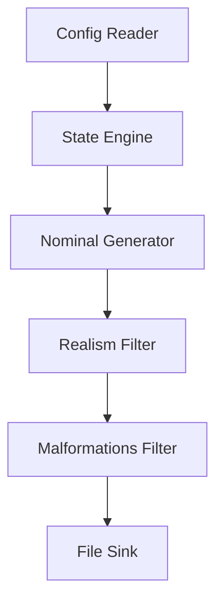

# Stochastic Data Generator: High Level Design Document

---

## 1.0 Context

### 1.1 Objective

This program is designed to create a singular interface for testing a variety of data analytics or data science style problems by generating fake data with random operational noise. The program also intends to approximate reality by allowing dynamic behavior regimes and state transitions (e.g., Markovian performance shifts) to be selected within the data generation, allowing the operational data to change character over time.

### 1.2 Background

The intent behind this program is to solve a known problem in the data design sector by allowing near operational data to be used instead of production data. Rather than individual mockups, this program will be able to output most kinds of data needed to plumb into a data analytics dashboard, a data science model, or even an operations research paper. Often times this form of mock up requires the user to manually create static data or small noisy data sets, using this tool the data will create itself independent of any real operation allowing complete sandbox testing and validation before a system is implemented into a production environment.

---

## 2.0 Design Overview

### 2.1 Overview

The intial program will be a configurable .yaml file which then can be executed upon by the program. The program will make multiple passes over the data starting from perfectly optimal and ending with messy and "real". A high level overview of these multiple passes will look like the below figure.



### 2.2 Functional Requirements

* Must accept a .yaml config path
* Must shift entity states across epoch boundaries using a configurable transition matrix
* Must output as a selectable style (CSV/JSON)

### 2.3 Capacity Estimates

TBD Post MVP

### 2.4 Interfaces

Currently the only accepted input stream for the program is a config.yaml file outlined below:

```yaml
simulation:
  seed: 42
  start_time: "2026-01-01T00:00:00Z"
  duration: "90d"
  data_resolution: "1d"         # Daily record generation
  epoch_interval: "1d"          # Evaluate state/drift every day

entities:
  - id: "carrier_beta"
    entity_type: "logistics_partner"
    initial_state: "HEALTHY"
    
    # Starting coordinates in the 2D Metric Space
    initial_metrics:
      attainment_pct: 94.0
      lag_days: 0.2

    # -------------------------------------------------------------------
    # 1. 2D STATE SPACE DEFINITIONS
    # -------------------------------------------------------------------
    states:
      HEALTHY:
        # 2D Bounding Box for this state region [min, max]
        bounds:
          attainment_pct: [85.0, 100.0]
          lag_days: [0.0, 1.0]
        
        # Local drift physics within this region
        drift:
          attainment_rate: 0.1     # Slightly recovers over time
          lag_rate: -0.05
          volatility: 0.5          # Standard deviation of Gaussian noise
        
        # Sticky boundary resistance (higher = harder to push through edge)
        boundary_stiffness: 0.8

      DEGRADED:
        bounds:
          attainment_pct: [65.0, 85.0]
          lag_days: [1.0, 3.0]
        drift:
          attainment_rate: -0.5    # Negative drift slope
          lag_rate: 0.2
          volatility: 1.2
        boundary_stiffness: 0.4

      CRITICAL:
        bounds:
          attainment_pct: [0.0, 65.0]
          lag_days: [3.0, 10.0]
        drift:
          attainment_rate: -2.0
          lag_rate: 0.8
          volatility: 3.0
        boundary_stiffness: 0.1

    # -------------------------------------------------------------------
    # 2. MACRO SHOCKS ("Magic Teleports" / Black Swans)
    # Evaluated BEFORE normal 2D physics. Bypasses spatial boundaries.
    # -------------------------------------------------------------------
    macro_shocks:
      - name: "regional_disaster"
        probability_per_epoch: 0.002   # 0.2% chance per day
        target_state: "CRITICAL"
        instant_metric_overrides:      # Teleport coordinates
          attainment_pct: 45.0
          lag_days: 4.5

      - name: "emergency_contract_bailout"
        probability_per_epoch: 0.001   # 0.1% chance per day
        target_state: "HEALTHY"
        instant_metric_overrides:
          attainment_pct: 90.0
          lag_days: 0.5

    # -------------------------------------------------------------------
    # 3. BACKLOG & DEFERRAL POLICY (Queue Aging Rules)
    # -------------------------------------------------------------------
    deferral_policy:
      enabled: true
      max_drift_ttl_epochs: 3          # Hard cancellation after 3 days late
      base_probabilities:
        fulfillment: 0.85              # On-time execution
        deferral: 0.10                 # Roll load to t+1
        cancellation: 0.05             # Instant drop
      aging_rules:
        cancel_escalation_per_epoch: 0.15 # +15% cancel chance per rolled day
```

### 2.5 Data Model

Terminology will be domain-agnostic in nature with the following being the dictionary used:

* **Entity:** The target object (e.g., Partner, Sensor, Customer)

* **State:** Active operational regime (e.g., Target, Degraded, Critical)

* **Metric:** Numeric value emitted per step (e.g., Attainment Percent, Temperature)

* **Epoch:** Time interval between state transition checks

---

## 3.0 Detailed Design

### 3.1 Details

* **Configuration Reader:** - The purpose of this module is to read in the configurations in order to identify how the data generation needs to occur.

* **State Engine:** - The purpose of this module is to evaluate the state and state transitions of each entity over a given epoch. This module allows probablistic changes and is not a fixed event generator. This is a toggleable module.

* **Nominal Generator:** - The purpose of this module is the intital pass through the data, in this step an "ideal" generation is performed ensuring every potential and expected slot is filled.

* **Realism Filter:** - This pass allows the intended data to be adjusted by realistic metric additions (e.g., drift or attainment failures)

* **Malformations Filter:** - This pass uniquely adds a level of corruption to the data file. This is done at a fixed percentage chance per the config and will apply things like changes to spelling, formatting errors etc. This is a toggleable module.

* **File Sink:** - This is the output of the program. During the MVP portion this is selectable to either a CSV or JSON output.

### 3.2 Dependencies

* Python Standard Library

* PyYAML

* custom_utils for logging

* pytest for testing

### 3.3 Technical Debt

TBD Post MVP

---

## 4.0 Alternatives Considered

During the research of this program, it was determined that no suitable commercial alternative exists. Tools such as `Faker` and `Mimesis` exist, however these cannot simulate temporal based changes to the data and are completely state-agnostic. Tools like `SDV` and other generative ML models require a level of production data to exist in order to synthesize similar production data. This leaves a gap in the space of "production-like" data with stateful changes to be used during heavy experimentation or startup testing where no comperable data exists.

---

## 5.0 Quality Attributes

### 5.1 Reliability

TBD Post MVP

### 5.2 Data Integrity

TBD Post MVP

### 5.3 Scalability

TBD Post MVP

### 5.4 Testability

All edge cases will be guarded and tested against using `pytest`. 

All deterministic behaviors will be tested using fixed random seeds and can be reproduced in production by setting a fixed seed in the configs.

---

## 6.0 Operations

### 6.1 Logging Plan

Using the `custom_utils` logger function, each step along the path will be captured into a singular log file. This includes things from config initialization through epoc transitions and file export summaries.

---

## 7.0 Future Additions

* Input dictionaries

* Customer records

* Real-time database streaming

* API output

* Parquet exports

* CLI / GUI implementation

* Alternative data streams as the needs arise