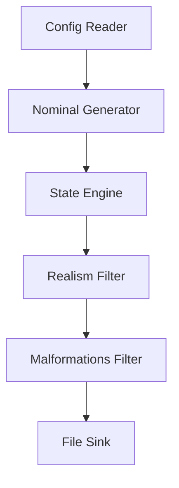
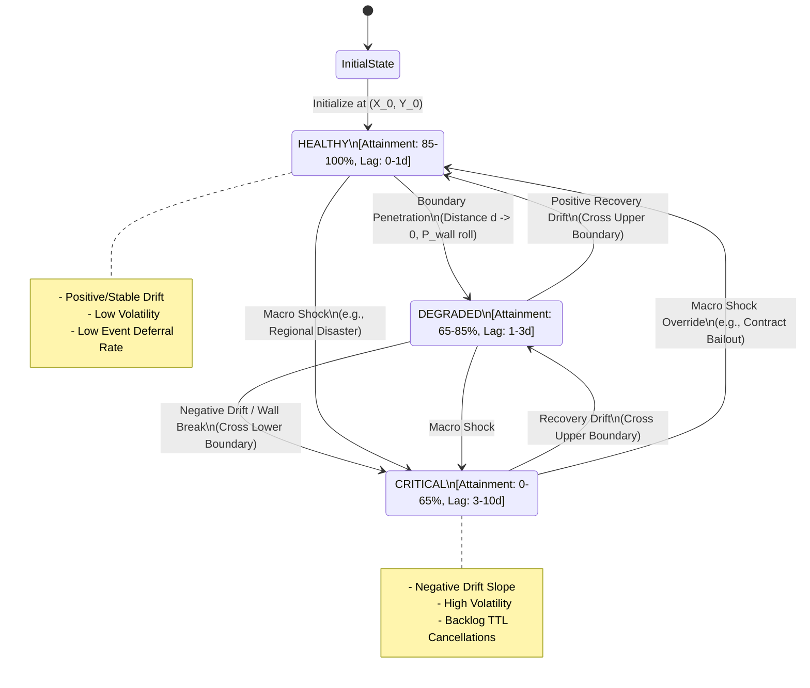

# Stochastic Data Generator: High Level Design Document

---

## 1.0 Context

### 1.1 Objective

This program is designed to create a singular interface for testing a variety of data analytics or data science style problems by generating fake data with random operational noise. The program also intends to approximate reality by allowing dynamic behavior regimes and state transitions (e.g., Markovian performance shifts) to be selected within the data generation, allowing the operational data to change character over time.

### 1.2 Background

The intent behind this program is to solve a known problem in the data design sector by allowing near operational data to be used instead of production data. Rather than individual mockups, this program will be able to output most kinds of data needed to plumb into a data analytics dashboard, a data science model, or even an operations research paper. Often times this form of mock up requires the user to manually create static data or small noisy data sets, using this tool the data will create itself independent of any real operation allowing complete sandbox testing and validation before a system is implemented into a production environment.

---

## 2.0 Design Overview

### 2.1 Overview

The intial program will be a configurable .yaml file which then can be executed upon by the program. The program will make multiple passes over the data starting from perfectly optimal and ending with messy and "real". A high level overview of these multiple passes will look like the below figure.



During this step the high level data responsibilies are as follows:

* Nominal Generator -> Generates an ideal "Pragmatic Baseline" (e.g., 50 scheduled loads at t=10). Zero state awareness, zero noise.

* State Engine -> Computes TRUE underlying state ($S_t$) and TRUE metric position ($\mu_t$). Calculates macro-drift and boundary checks.

* Realism Filter -> Combines nominal baseline + state engine outputs:
  * Applies volatility noise: Observed Metric $M_t = \mu_t$ + Noise
  * Executes deferral queue: Uses $M_t$ to roll/cancel events.

* Malformations -> Schema & syntax corruption (nulls, string typos, etc.).

```mermaid
stateDiagram-v2
    [*] --> INITIALIZING

    state INITIALIZING {
        [*] --> ParseConfig
        ParseConfig --> ValidateSchema
        ValidateSchema --> InitializeEntities
        InitializeEntities --> SeedRNG
    }

    INITIALIZING --> RUNNING_SIMULATION : Config Valid
    INITIALIZING --> ERROR_EXIT : Config/Schema Failure

    state RUNNING_SIMULATION {
        [*] --> GenerateNominalBatch
        
        state Nominal_Pass {
            GenerateNominalBatch --> OutputPragmaticBaseline
        }

        state Epoch_State_Engine {
            OutputPragmaticBaseline --> EvaluateMacroShocks : Epoch Boundary Cross
            EvaluateMacroShocks --> Calculate2DDrift
            Calculate2DDrift --> ResolveStickyBoundaries
        }

        state Realism_and_Corruption_Pipeline {
            ResolveStickyBoundaries --> ApplyRealismFilter : Pass (Nominal + State M_t)
            ApplyRealismFilter --> ProcessBacklogQueue
            ProcessBacklogQueue --> ApplyMalformationFilter
        }

        Realism_and_Corruption_Pipeline --> WriteToSink
        WriteToSink --> GenerateNominalBatch : Increment Time Step (t < T)
    }

    RUNNING_SIMULATION --> TERMINATING : Simulation Complete (t >= T)
    RUNNING_SIMULATION --> ERROR_EXIT : Runtime Exception

    state TERMINATING {
        [*] --> FlushBuffers
        FlushBuffers --> WriteLogSummary
        WriteLogSummary --> [*]
    }

    ERROR_EXIT --> [*]
```

### 2.2 Functional Requirements

* Must accept a .yaml config path
* Must shift entity states across epoch boundaries using a configurable transition matrix
* Must output as a selectable style (CSV/JSON)

### 2.3 Capacity Estimates

TBD Post MVP

### 2.4 Interfaces

Currently the only accepted input stream for the program is a config.yaml file outlined below using sample selections:

```yaml
simulation:
  seed: 42
  start_time: "2026-01-01T00:00:00Z"
  duration: "90d"
  data_resolution: "1d"         # Daily record generation
  epoch_interval: "1d"          # Evaluate state/drift every day

entities:
  - id: "carrier_beta"
    entity_type: "logistics_partner"
    initial_state: "HEALTHY"
    
    # Starting coordinates in the 2D Metric Space
    initial_metrics:
      attainment_pct: 94.0
      lag_days: 0.2

    # Absolute safety rail bounds
    global_bounds:
      attainment_pct: [0.0, 100.0]
      lag_days: 0.2

    # -------------------------------------------------------------------
    # 1. 2D STATE SPACE DEFINITIONS
    # -------------------------------------------------------------------
    states:
      HEALTHY:
        # 2D Bounding Box for this state region [min, max]
        bounds:
          attainment_pct: [85.0, 100.0]
          lag_days: [0.0, 1.0]
        
        # Local drift physics within this region
        drift:
          attainment_rate: 0.1     # Slightly recovers over time
          lag_rate: -0.05
          volatility: 0.5          # Standard deviation of Gaussian noise
        
        # Sticky boundary resistance (higher = harder to push through edge)
        boundary_stiffness: 0.8

      DEGRADED:
        bounds:
          attainment_pct: [65.0, 85.0]
          lag_days: [1.0, 3.0]
        drift:
          attainment_rate: -0.5    # Negative drift slope
          lag_rate: 0.2
          volatility: 1.2
        boundary_stiffness: 0.4

      CRITICAL:
        bounds:
          attainment_pct: [0.0, 65.0]
          lag_days: [3.0, 10.0]
        drift:
          attainment_rate: -2.0
          lag_rate: 0.8
          volatility: 3.0
        boundary_stiffness: 0.1

    # -------------------------------------------------------------------
    # 2. MACRO SHOCKS ("Magic Teleports" / Black Swans)
    # Evaluated BEFORE normal 2D physics. Bypasses spatial boundaries.
    # -------------------------------------------------------------------
    macro_shocks:
      - name: "regional_disaster"
        probability_per_epoch: 0.002   # 0.2% chance per day
        target_state: "CRITICAL"
        instant_metric_overrides:      # Teleport coordinates
          attainment_pct: 45.0
          lag_days: 4.5

      - name: "emergency_contract_bailout"
        probability_per_epoch: 0.001   # 0.1% chance per day
        target_state: "HEALTHY"
        instant_metric_overrides:
          attainment_pct: 90.0
          lag_days: 0.5

    # -------------------------------------------------------------------
    # 3. BACKLOG & DEFERRAL POLICY (Queue Aging Rules)
    # -------------------------------------------------------------------
    deferral_policy:
      enabled: true
      max_drift_ttl_epochs: 3          # Hard cancellation after 3 days late
      base_probabilities:
        fulfillment: 0.85              # On-time execution
        deferral: 0.10                 # Roll load to t+1
        cancellation: 0.05             # Instant drop
      aging_rules:
        cancel_escalation_per_epoch: 0.15 # +15% cancel chance per rolled day

output:
  format: "csv"                   # "csv", "json", etc.
  path: "outputs/generated_data.csv"

  # 1. USER REQUESTED DATA (Custom payload mapping)
  fields:
    - name: "timestamp"           # Output column header
      source: "simulation_time"   # Engine variable
    - name: "carrier_code"        # Output column header
      source: "entity_id"         # Engine variable
    - name: "attainment_rate"     # Output column header
      source: "metrics.attainment_pct" # Maps M_t for attainment_pct

  # 2. OPTIONAL TOGGLES (Engine Metadata & Debug Flags)
  metadata_toggles:
    include_state: true           # Appends "state" column (e.g., "HEALTHY")
    include_malformed_flag: false # Appends "is_malformed" boolean column
    include_true_baseline: false  # Appends "true_position" (mu_t) column for debugging
```

The file sink produces dynamic schemas based on the `output.fields` array defined in the configuration. Users map standard engine attibutes (timestamps, entity IDs, metric values) to arbitrary column headers. Optional boolean flags under metadata_toggles allow users to selectively append system state labels, noise flags, or true baselines for validation and debugging.

### 2.5 Data Model

Terminology will be domain-agnostic in nature with the following being the dictionary used:

* **Entity:** The target object (e.g., Partner, Sensor, Customer)

* **State:** Active operational regime (e.g., Target, Degraded, Critical)

* **Metric:** Numeric value emitted per step (e.g., Attainment Percent, Temperature)

* **Epoch:** Time interval between state transition checks

* **True Metric Position ($\mu_t$):** The deterministic baseline coordinate of the entity. State transitions and 2D bounding box checks run exclusively on $\mu_t$.

* **Observed Metric ($M_t$):** The final emitted value equal to $\mu_t +$ Volatility Noise ($\mathcal{N}(0,\sigma^{2})$).

* **Global Bounds:** Absolute physical boundaries that clamp values to prevent Out-Of-Bounds (OOB) compounding.

* **epoch_interval:** How often the state engine re-evaluates state transitions, macro-shocks and updates $\mu_t$.

* **data_resolution:** How often output rows are emitted.

---

## 3.0 Detailed Design

### 3.1 Details

* **Configuration Reader:** - The purpose of this module is to read in the configurations in order to identify how the data generation needs to occur. Contains fail-fast check asserting that `initial_metrics` falls strictly within the `bounds` of `initial_state`.

* **State Engine:** - The purpose of this module is to evaluate the state and state transitions of each entity over a given epoch. This module allows probablistic changes and is not a fixed event generator. This is a toggleable module.

  * Macro-Shock Order of Operations: Rule here is that macro-shocks suppress and override normal drift for the selected epoch. Logic flow on this is that if a shock triggers, $S_t$ and $\mu_t$ are both set via the shock, local drift and boundary checks will be skipped for the epoch. Otherwise if the shock does not trigger, standard drift and boundary rules apply.

  * Exponential Decay Boundary Resolution: When true position $\mu_t$ moves toward a state boundary wall, the probability of "breaking through" the wall into an adjacent state box is governed by a Exponential Decay Barrier Function:
    $P(\text{Wall Break})=(1.0-\kappa)\cdot e^{-\lambda\cdot d}$

    $\kappa$: This is the boundary stiffness whcih directly controls the probability at the exact wall

    d: is defined as the minimum signed perpendicular distance from true postion to the nearest inner edge:
      $d=\min{x_t-X_{min}, X_{max}-x_t, y_t-Y_{min}, Y_{max}-y_t}$
    Inisde the box, d is the shortest Euclidean distance to any wall along either axis, at the boundary $\mu_t$ touches or lies on an edge, and when pushed outside the box by drift, d is clamped to 0.0 for the wall-break evaluation. If the wall break roll fails, $\mu_t$ is snapped back to the box at boundary edge.

    $\lambda$: Boundary Resistance scalar derived from `boundary_stiffness` ($\lambda=\frac{5.0}{\text{stiffness}}$).

    Execution: If $P(\text{Wall Break})\gt \text{RNG}()$, the entity transitions to the adjacent state box and snaps its baseline $\mu_t$ inside the new state bounds.

  * Resolution vs. Epoch Interpolation: Within an epoch, for each sub-step tick $dt=\frac{\text{resolution}}{\text{epoch_interval}}$, fractional drift is applied incrementally:
    $\mu_{t+dt}=\mu_t+(\text{drift_rate}\cdot dt)+\mathcal{N}(0,\sigma\sqrt{dt})$
  This creates smooth continuous intra-epoch motion rather than jagged teleports at epoch boundaries.



* **Nominal Generator:** - The purpose of this module is the intital pass through the data, in this step an "ideal" generation is performed ensuring every potential and expected slot is filled.

* **Realism Filter:** - This pass allows the intended data to be adjusted by realistic metric additions (e.g., drift or attainment failures)

  * Obscured Border Effect: If a state border sits at 0.8 and $\mu_t$=0.78, a volitility drawdown ($\sigma$=0.05) might output an observed $M_t$=0.83. The output appears to have crossed boundaries into a new state, however the true state remains unchanged. This mimics real-world measurement noise obscuring internal operational boundaries.

  * OOB Safeguard: Hard global bounds ([GLOBAL_MIN, GLOBAL_MAX]) clamp both $\mu_t$ and $M_t$ as a final safety rail.

  * Deferral/Backlog Queue Dynamics: This is a one way coupled system, Observed attainment ($M_t$) directly drives the daily fulfillment probability $P_{\text{fulfillment}}=M_t$. As $M_t$ drops, load deferral spikes. The resulting backlog depth is emitted as an auxiliary output column, keeping queue dynamics clean without creating unstable recursive feedback loops into $\mu_t$.

  * To prevent mixing percentages with probailities, $P_{\text{fulfillment}}$ will first pass through this normalization clamp formula:
    $P_{\text{fulfillment}} = \text{clamp}\left(\frac{M_t}{100.0}, 0.0, 1.0 \right)

* **Malformations Filter:** - This pass uniquely adds a level of corruption to the data file. This is done at a fixed percentage chance per the config and will apply things like changes to spelling, formatting errors etc. This is a toggleable module.

* **File Sink:** - This is the output of the program. During the MVP portion this is selectable to either a CSV or JSON output. The output module (CSV/JSON). Streams output to a temporary file (.tmp_output.csv) during execution. Upon reaching the TERMINATING state, the file is atomically renamed to the configured path. On runtime exceptions (ERROR_EXIT), the temporary file is purged to prevent partial/corrupted writes.

### 3.2 Dependencies

* Python Standard Library

* PyYAML

* custom_utils for logging

* pytest for testing

* RNG Substream Strategy: To ensure entity B's config doesn't break entity A's deterministic sequence:
  * The master `seed` initializes a `numpy.random.SeedSequence`
  * Each entity spawns an isolated `BitGenerator` stream derived from its unique `entity_id`:
  ```python
  entity_seed = seed_sequence.spawn_key(hash(entity_id))
  entity_rng = np.random.default_rng(entity_seed)
  ```

### 3.3 Technical Debt

TBD Post MVP

---

## 4.0 Alternatives Considered

During the research of this program, it was determined that no suitable commercial alternative exists. Tools such as `Faker` and `Mimesis` exist, however these cannot simulate temporal based changes to the data and are completely state-agnostic. Tools like `SDV` and other generative ML models require a level of production data to exist in order to synthesize similar production data. This leaves a gap in the space of "production-like" data with stateful changes to be used during heavy experimentation or startup testing where no comperable data exists.

---

## 5.0 Quality Attributes

### 5.1 Reliability

TBD Post MVP

### 5.2 Data Integrity

TBD Post MVP

### 5.3 Scalability

TBD Post MVP

### 5.4 Testability

All edge cases will be guarded and tested against using `pytest`. 

All deterministic behaviors will be tested using fixed random seeds and can be reproduced in production by setting a fixed seed in the configs.

---

## 6.0 Operations

### 6.1 Logging Plan

Using the `custom_utils` logger function, each step along the path will be captured into a singular log file. This includes things from config initialization through epoc transitions and file export summaries.

---

## 7.0 Future Additions

* Input dictionaries

* Customer records

* Real-time database streaming

* API output

* Parquet exports

* CLI / GUI implementation

* Alternative data streams as the needs arise

* Multi-entity correlation (shared shocks)